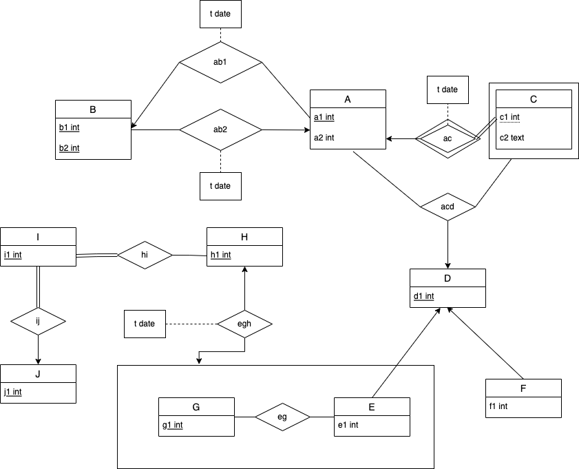
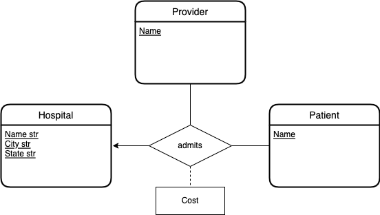

# Homework 1

* Assigned: 9/5
* Due:
    * Part 1: 9/11 11:59PM
    * Part 2: TBA
    * (Part 1 and Part 2 are due separately!)
* Value: 3.75% of your grade
* Done and submitted individually (as with all the homeworks) **via [Gradescope](https://www.gradescope.com)**

GRADESCOPE

* Use the link https://www.gradescope.com/courses/842574/ (entry code **XG8W55** if you weren't already added)
* If you do not already have an account, use your `xx1234@columbia.edu` email!

# Part 1

## 1.1 (5 points) ER design: Calendar Events

We will now describe the functionality and specifications of a Calendar application (like Vimcal or Google Calendar) for tracking and scheduling events.
You will be asked to identify the aspects that are relevant for designing the appropriate database.

### Description

Users

* **Users** have an **email** address, **name**, and **birthdate**.  A user always has an email address that uniquely identifies them.
* A user can be the **executive assistant (EA)** for another user (the boss).   The EA can schedule events on behalf of the boss.

Calendars

* **Calendars** have a **calendar_id** and can be public or private.
* Each calendar is **owned** by a single user.  A calendar cannot exist without an owner, and its **calendar_id** is unique globally across all users.  
* A calendar can be shared with many users, and a user can have multiple calendars shared with them.

Events

* **Events** have **event_id**, **title**, and **description**. **event_id** is unique globally.  
* Events keep track of **when** they occur.    
* Each **when** has a date,  and may optionally  **recur** weekly on the same day of the week as the date.  If so, the user can optionally state the date when the recurring event should end.
* Each **when** is either  **all day** or a **time range**. A time range also has a **start** and **end** hour.
* Events only occur at one **when**.
* An event is either a **meeting** or a **focustime**.
* A meeting can **invite** any number of users as guests.
* A focustime uses a boolean **autodecline** to automatically decline meetings during the focus time.
* An event **must be owned** by exactly one calendar, and cannot exist without a calendar.

Slots

* To make scheduling easier, a user can create **Slot**s in their calendar, which tentatively block off time in their calendar.
* A **Slot** has a **slot_id** and a unique **url** that the user (called the sender) can send to another user (called the recipient) to schedule a meeting.
* A **Slot** has one or more **options**, where each option is a nonrecurring time range that is unique to the specific **Slot**.
  This means that for a given **Slot**, there cannot be two identical options.  But there may be duplicate options across different **Slot**s.
* When the recipient navigates to the link, they can click on one **option** to choose that meeting time.  The chosen **option** is turned into an **Event** 
  in the sender's calendar and shared with the recipient.   The other **options**s in the **Slot** are removed.  

State any assumptions you make.

### Your Task

1. Render the calendar database using the ER diagram notation described in lecture, with exactly the constraints and requirements specified above. 
2. State any assumptions that you make, but make sure that you don’t introduce new constraints that are not listed in the problem definition.
3. Suppose we now want to let users record notes for a given instance of a meeting (if a meeting is recurring, an instance is the meeting on a specific day).    Given the ER diagram you drew. state in 1-2 sentences how it could be extended to support this new use case, or why it would be difficult to extend the diagram. 

Notes

* You can draw the diagram by hand and scan it, or use an app like powerpoint or https://app.diagrams.net/
* If you scan a diagram, make sure it is easily legible.  Parts that the staff cannot read/interpret will be considered incorrect.
* If the specification does not explicitly provide a key attribute for an entity set, you can assume there is an id.
* ER diagrams should use the diagrammatic notation covered in class.
  **We will penalize ER diagrams that use features not covered, and interpret notations different from those introduced in class as incorrect.**

## 1.2. (5 points) More Database Design

EdStem is a web based discussion board that our course uses.   It allows staff to disseminate important course updates, for students to ask questions, and for their peers and staff to followup with a thread of replies to help answer the question.  
Go to the [example discussion in the course's Ed Discusion](https://edstem.org/us/courses/61495/discussion/5188213), create replies and interact with the features on the web page to understand how threads work and their data requirements.   

<!--
GitHub is a web based Git repository hosting service that provides version control and source code management functionality. It provides several collaboarative features like bug tracking, task management, and contribution analytics for every project. Handling big code bases and with multiple people working on them, indeed becomes a tedious task, GitHub helps to make this exercise easier. GitHub’s bug tracker is called Issues, and has its own section in every repository. Issues are kind of like shared e-mails, and a great way to keep track of tasks, enhancements, and bugs for the projects. You may learn more about github issues at [Github-Issues](https://guides.github.com/features/issues/) 

Visit the issues page of any public repository on Github, For example, visit [Tensorflow-Issues](https://github.com/tensorflow/tensorflow/issues). Analyze the page and the linked issue pages to understand its data requirements.  
-->

Then, 

* Design an E-R diagram for the website that captures its main functionality of posts and replies.  
* Include at least 4 entities, 4 relationships, and 3 constraints, in the same format as part 1 of this homework.
* One of the entities should be **Post**.
* For each entity, relationship and constraint, include a 1-2 sentence description that justifies your decision to include it and design it in the matter that you did.

# Part 2

## 2.1. (5 points) Logical Database Design

Write the SQL `CREATE TABLE` statements and relevant constraints to convert the following ER diagram into a relational schema.  If some constraints in the ER diagram cannot be captured in the relational model, explain why.

## 2.2. (2 points) More ER Diagrams

Suppose your colleague Bob decided to download the following health dataset concerning hospitals, patient bills, and the insurance providers.   The datasetcontains the following sample rows:

    hospital  city    state  patient  cost  provider
    ------------------------------------------------------
    MGH       Boston  MA     eugene    100  unitedhealth
    MGH       Boston  MA     alice     101  unitedhealth
    MGH       Boston  MA     mort     1000  unitedhealth
    Mt Sinai  NY      NY     bob         5  aetna
    Mt Sinai  NY      NY     daisy       2  aetna

Bob wanted to draw an ER diagram that expressed the relations between entities of this specific dataset, so he came up with the following:

What is the mistake in Bob's approach for this problem? Draw a corrected ER diagram, or explain why it is not possible to do so.
